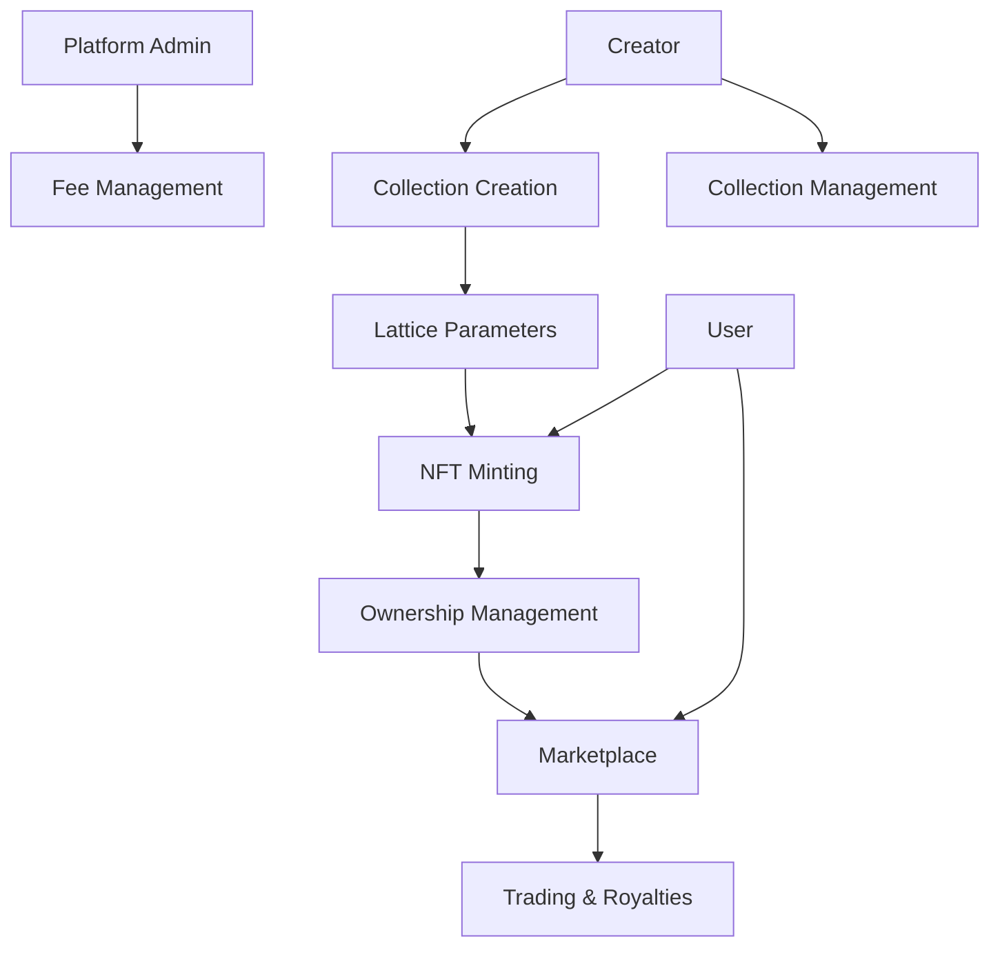

# ERC721 Orchestrated Set

A powerful, flexible NFT platform enabling the creation, minting, and trading of dynamic digital collections with advanced orchestration capabilities on the Stacks blockchain.

## Overview

ERC721 Orchestrated Set is an innovative NFT platform that provides creators with a robust framework for generating, managing, and trading unique digital assets. The platform offers advanced orchestration features that enable complex collection management, flexible minting strategies, and comprehensive marketplace functionality.

### Key Features
- Create collections with customizable lattice parameters
- Mint NFTs with verifiable uniqueness
- Built-in marketplace functionality
- Creator royalties support
- Mathematical parameter storage for each collection
- Client-side rendering based on on-chain parameters

## Architecture

The platform is built around a single core smart contract that manages all aspects of the NFT ecosystem, from collection creation to marketplace operations.



## Contract Documentation

### Core Contract: nft-orchestrator.clar

#### Purpose
Manages the entire lifecycle of lattice-based NFTs, including collection creation, minting, trading, and marketplace functionality.

#### Key Components
1. **Collections**: Stores collection metadata and minting parameters
2. **Lattice Parameters**: Defines the mathematical properties of each collection
3. **NFTs**: Manages individual token ownership and metadata
4. **Marketplace**: Handles listings and sales
5. **Royalties**: Automated royalty distribution system

## Getting Started

### Prerequisites
- Clarinet installed
- Stacks wallet for deployment/interaction

### Usage Examples

1. Create a Collection:
```clarity
(contract-call? .nft-orchestrator create-collection 
    "My Lattice Art"
    "A collection of geometric patterns"
    u100 ;; max supply
    u10000000 ;; mint price (10 STX)
    u250 ;; royalty (2.5%)
    "ipfs://..." ;; metadata URI
    u2 ;; dimensions
    u16 ;; nodes
    ;; ... other parameters
)
```

2. Mint an NFT:
```clarity
(contract-call? .nft-orchestrator mint-nft u1 u12345678)
```

3. List NFT for Sale:
```clarity
(contract-call? .nft-orchestrator list-nft-for-sale u1 u1 u20000000)
```

## Function Reference

### Collection Management
- `create-collection`: Create a new lattice collection
- `set-collection-status`: Toggle minting status
- `get-collection`: Read collection details

### NFT Operations
- `mint-nft`: Mint a new NFT
- `transfer-nft`: Transfer NFT to another address
- `get-nft`: Get NFT details
- `get-nft-owner`: Get current owner

### Marketplace
- `list-nft-for-sale`: List NFT on marketplace
- `cancel-listing`: Remove marketplace listing
- `buy-nft`: Purchase listed NFT

### Administrative
- `set-platform-fee`: Update platform fee percentage
- `set-contract-admin`: Transfer admin rights

## Development

### Local Testing
```bash
# Run local tests
clarinet test

# Check contract
clarinet check
```

### Deployment
```bash
# Deploy to testnet
clarinet deploy --testnet

# Deploy to mainnet
clarinet deploy --mainnet
```

## Security Considerations

### Limitations
- Maximum royalty rate of 30%
- Maximum platform fee of 10%
- Collection size must be greater than 0
- Minimum of 2 nodes per lattice

### Best Practices
1. Always verify transaction status
2. Check NFT ownership before operations
3. Ensure sufficient STX balance for purchases
4. Validate collection parameters before minting
5. Monitor listing prices for accuracy

### Data Privacy
- Seed values and parameters are public on-chain
- Consider using IPFS or similar for storing detailed metadata
- Client-side rendering keeps computational load off-chain